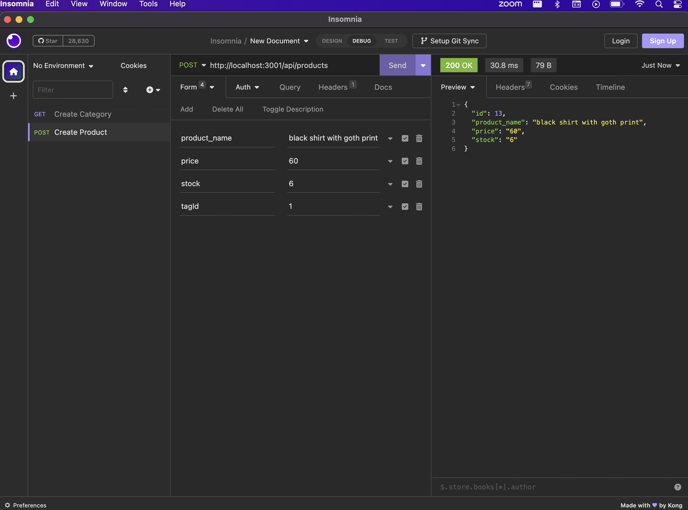

# Object-Relational Mapping (ORM): E-Commerce Back End

ORM - E-commerce Back End

Git Hub: 

Video Link:

## Badges


## Table of Contents
- [Description](#description)
- [Installation](#installation)
- [Usage](#usage)
- [Screenshots](#screenshots) 
- [License](#license)

## Description

This project's purpose is to create a database using SQL and Sequilized for an Object Relational Mapping app that stores categories, products and tags in its database.  Using this database, you will be able to create, read, update and delete within the category, products or tags' tables.  

## Installation

You will need to install npm. This will install the mysql, inquirer, dotenv, and express packages as well.  Then you will need to run the npm seeds : "npm run seeds".  You can then run "npm start" to start the app listening to the local host. 

## Usage
```md
To use this app, follow the installation instructions above.  
Once you start npm by typing in "npm start" in the command line, it will prompt a message saying that it is listening to the localhost:3001. Then you can open up insomnia.

WHEN you GET for the api/categories route, 
THEN it will display all of the categories in the database
WHEN you GET from the api/categories with a specific id at the end of the url,
THEN it will show you only that category that the id belongs to.
WHEN you POST in the api/categories and enter in fields that pertain to the category model,
THEN you are able to create a new category into the database.
WHEN you PUT in the api/categories url with the fields you want to update,
THEN you are able to update that category's field in the database.
WHEN you DELETE in the api/categories using a specific id, 
THEN it will destroy that category with that id.

WHEN you GET for the api/products, 
THEN you will get all of the products listed in the database.
WHEN you POST in the api/products and enter in fields that pertains to the product model,
THEN it will add any new products to the products database.  
   
```
## Screenshots
GET PRODUCTS


GET PRODUCT


POST PRODUCT

PUT PRODUCT


DELETE PRODUCT


## License
Please refer to the link below if you need to read the terms and conditions of the license:
* [MIT license](https://choosealicense.com/licenses/mit/)
